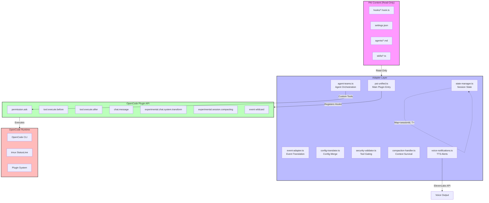

# PAI-OpenCode Adapter

[](https://opensource.org/licenses/MIT)
[](https://github.com/anditurdiu/pai-opencode-adapter)
[](https://github.com/anditurdiu/pai-opencode-adapter)

**Run [PAI](https://github.com/danielmiessler/Personal_AI_Infrastructure) without an Anthropic subscription.** Use any LLM provider — OpenAI, Google, Ollama, or Anthropic — through [OpenCode](https://opencode.ai), the open-source AI coding assistant.

> **Background:** PAI (Personal AI Infrastructure) is a powerful personal AI system by Daniel Miessler, but it currently requires Claude Code and an Anthropic subscription. This adapter removes that lock-in by translating PAI's hook system into OpenCode's plugin API. Born from [community request (issue #98)](https://github.com/danielmiessler/Personal_AI_Infrastructure/issues/98).

## Why This Adapter?

PAI gives you structured AI workflows (the Algorithm), 63+ skills, 14 agents, memory systems, and a life OS (TELOS). But today it only runs on Claude Code, which requires an Anthropic Max subscription ($100-200/mo).

This adapter lets you run the **full PAI experience** on OpenCode with **any LLM provider**:

| Provider | Models | Cost |
|----------|--------|------|
| **Anthropic** | Claude Sonnet/Opus | API pay-as-you-go (no Max sub needed) |
| **OpenAI** | GPT-4o, o1 | API pay-as-you-go |
| **Google** | Gemini Pro/Flash | Free tier available |
| **Ollama** | Llama 3, Mistral | Free (runs locally) |
| **Any OpenCode-supported provider** | Various | Varies |

## Overview

The PAI-OpenCode Adapter is a **plugin adapter layer**, not a fork. It sits between [PAI v4.0.3](https://github.com/danielmiessler/Personal_AI_Infrastructure) content (hooks, settings, agents) and the OpenCode plugin API, translating events and configurations so your PAI workflows run unchanged on OpenCode.

**Key characteristics:**

- **No Anthropic subscription required** — Use any LLM provider via OpenCode
- **MIT Licensed** — Permissive open-source, no SUL-1.0 restrictions
- **Adapter pattern** — Wraps PAI content, never modifies it
- **Zero forks** — Upgrades are diffs, not merges
- **Read-only PAI** — Your `~/.claude/` directory remains untouched
- **Session-scoped state** — No global variables, safe concurrent sessions
- **File-based logging** — Never corrupts OpenCode TUI with console.log

**What this adapter does:**

1. **Event translation** — Maps 20 PAI semantic hooks to 17 OpenCode plugin events
2. **Config translation** — Converts `settings.json` to `opencode.json` format
3. **State management** — Per-session state with automatic cleanup
4. **Security validation** — Tool gating and input sanitization
5. **Compaction handling** — Dual proactive and reactive session compaction
6. **Voice notifications** — ElevenLabs TTS for task completion alerts
7. **Agent teams** — Multi-agent orchestration via custom OpenCode tools

**What this adapter does NOT do:**

- Modify PAI source files (read-only wrapper)
- Add npm dependencies beyond TypeScript
- Auto-merge updates (human review always required)

**License:** MIT — See [LICENSE](LICENSE) for full text.

---

## Architecture



**Seven sub-systems:**

| Sub-system | File | Responsibility |
|------------|------|----------------|
| Event Adapter | `src/adapters/event-adapter.ts` | PAI → OpenCode event translation |
| Config Translator | `src/adapters/config-translator.ts` | `settings.json` → `opencode.json` |
| State Manager | `src/lib/state-manager.ts` | Session-scoped `Map<sessionId, T>` |
| Security Validator | `src/handlers/security-validator.ts` | Tool gating, input sanitization |
| Compaction Handler | `src/handlers/compaction-handler.ts` | Proactive + reactive compaction |
| Voice Notifications | `src/handlers/voice-notifications.ts` | ElevenLabs TTS, ntfy, Discord |
| Agent Teams | `src/handlers/agent-teams.ts` | Multi-agent dispatch via custom tools |

**Additional components:**

| Component | File | Purpose |
|-----------|------|---------|
| Dedup Cache | `src/core/dedup-cache.ts` | 5s TTL message deduplication |
| Event Bus | `src/core/event-bus.ts` | Internal event pub/sub |
| File Logger | `src/lib/file-logger.ts` | `/tmp/pai-opencode-debug.log` |
| Model Resolver | `src/lib/model-resolver.ts` | Per-role model routing with fallback chains |
| StatusLine | `src/statusline/statusline.sh` | tmux status-right integration |
| Self-Updater | `src/updater/self-updater.ts` | Monitors PAI + OC for updates |
| CLI Shim | `src/adapters/cli-shim.sh` | `claude` → `opencode` wrapper |

---

## Quick Start

Get the adapter running in 5 steps:

### Step 1: Clone the repository

```bash
cd ~/projects
git clone https://github.com/anditurdiu/pai-opencode-adapter.git
cd pai-opencode-adapter
```

### Step 2: Install dependencies

```bash
bun install
```

This installs TypeScript and type definitions. No additional npm packages required.

### Step 3: Build the plugin

```bash
bun build src/plugin/pai-unified.ts --target=bun --outdir=dist --external opencode
```

The build produces `dist/pai-unified.js`, the compiled plugin entry point.

### Step 4: Configure OpenCode

Add the plugin to your `~/.config/opencode/opencode.json`:

```json
{
  "provider": "anthropic",
  "model": "claude-sonnet-4-5",
  "plugin": [
    "file:///absolute/path/to/pai-opencode-adapter/src/plugin/pai-unified.ts"
  ]
}
```

**Important:** The `plugin` path **must** use a `file://` prefix for local plugins; without it, OpenCode tries to install the path as an npm package. PAI adapter-specific settings (identity, voice, notifications) go in a separate `~/.config/opencode/pai-adapter.json` file — see [Configuration](#configuration).

### Step 5: Run OpenCode

```bash
# Standard launch
opencode

# With tmux for StatusLine support
tmux new-session -s pai opencode
```

**Verification:**

Check that the plugin loaded:

```bash
tail -f /tmp/pai-opencode-debug.log
```

You should see entries like:

```
[2026-03-21T10:30:00.000Z] [INFO ] [pai-unified] plugin initialized
[2026-03-21T10:30:01.000Z] [INFO ] [context-loader] session started: sess_abc123
```

---

## PAI-Native Experience

The adapter deploys PAI-native agents, themes, and commands into OpenCode so that launching OpenCode *feels* like using PAI.

### Agents

| Agent | Type | Model | Purpose |
|-------|------|-------|---------|
| **Algorithm** | Primary (Tab) | Claude Opus 4.6 | Full PAI Algorithm v3.7.0 — structured 7-phase workflow |
| **Native** | Primary (Tab) | Claude Sonnet 4.6 | Fast, direct task execution without Algorithm overhead |
| **Research** | Subagent (@) | Gemini 3 Pro | Web research, code analysis, documentation retrieval |
| **Thinker** | Subagent (@) | Claude Opus 4.6 | Deep reasoning, architecture analysis, tradeoff evaluation |
| **Explorer** | Subagent (@) | Claude Sonnet 4.6 | Fast read-only codebase exploration |

Switch between Algorithm and Native with **Tab**. Invoke subagents with **@research**, **@thinker**, or **@explorer**.

### Theme

The PAI theme (`pai.json`) provides a dark blue/slate color scheme matching PAI's identity. It's auto-applied during installation. Change with `/theme` in the TUI.

### Commands

| Command | Description |
|---------|-------------|
| `/pai-setup` | Interactive onboarding wizard — configure identity, voice, preferences |
| `/algorithm [task]` | Start a task using the full PAI Algorithm workflow |
| `/native [task]` | Quick task execution in Native mode |
| `/telos [action]` | Review and update your TELOS life goals |

### File Layout

```
src/config/
├── agents/
│   ├── algorithm.md      # PAI Algorithm primary agent
│   ├── native.md         # PAI Native primary agent
│   ├── research.md       # Research subagent
│   ├── thinker.md        # Deep reasoning subagent
│   └── explorer.md       # Codebase exploration subagent
├── themes/
│   └── pai.json          # PAI color theme
└── commands/
    ├── pai-setup.md      # /pai-setup onboarding wizard
    ├── algorithm.md      # /algorithm command
    ├── native.md         # /native command
    └── telos.md          # /telos life goals command
```

These are deployed to `~/.config/opencode/{agents,themes,commands}/` by `install.sh`.

---

## Prerequisites

**Required:**

| Tool | Version | Purpose | Install Command |
|------|---------|---------|-----------------|
| OpenCode | ≥1.0 | Host CLI for plugin | `curl -fsSL https://opencode.ai/install \| bash` |
| PAI v4.0.3 | 4.0.3 | Source of hooks, agents, skills | `git clone https://github.com/danielmiessler/Personal_AI_Infrastructure` |
| Bun | ≥1.0 | Runtime and build tool | `curl -fsSL https://bun.sh/install \| bash` |
| TypeScript | ^5 | Type checking | `bun add -d typescript` |

**Optional (feature-specific):**

| Tool | Version | Feature | Install Command |
|------|---------|---------|-----------------|
| tmux | any | StatusLine in status-right | `brew install tmux` (macOS) or `apt install tmux` (Linux) |
| jq | any | StatusLine JSON parsing | `brew install jq` or `apt install jq` |
| gh (GitHub CLI) | any | Self-updater draft PRs | `brew install gh` or `apt install gh` |
| afplay / aplay | system | Voice/TTS audio playback | Built-in on macOS, `apt install alsa-utils` on Linux |

**Directory requirements:**

| Directory | Purpose | Default Path |
|-----------|---------|--------------|
| PAI content | Read-only hooks, agents, skills | `~/.claude/` |
| OpenCode config | Plugin registration | `~/.config/opencode/opencode.json` |
| Adapter state | Session state, logs | `~/.opencode/pai-state/` |
| Debug log | File-based logging | `/tmp/pai-opencode-debug.log` |

**PAI installation note:**

The adapter reads from PAI's `~/.claude/` directory but never writes to it. If PAI is not installed, the adapter will run in degraded mode (no skills, agents, or workflows available).

---

## Configuration

The adapter uses OpenCode's `opencode.json` for plugin registration, and a separate `pai-adapter.json` for adapter-specific settings.

### Minimal configuration

In `~/.config/opencode/opencode.json`:

```json
{
  "provider": "anthropic",
  "model": "claude-sonnet-4-5",
  "plugin": [
    "file:///absolute/path/to/pai-opencode-adapter/src/plugin/pai-unified.ts"
  ]
}
```

### Full configuration with all options

PAI adapter settings go in `~/.config/opencode/pai-adapter.json` (separate from `opencode.json`):

```json
{
  "paiDir": "~/.claude",
  "model_provider": "anthropic",
  "models": {
    "default": "anthropic/claude-sonnet-4-5",
    "validation": "anthropic/claude-sonnet-4-5",
    "agents": {
      "intern": "anthropic/claude-haiku-4-5",
      "architect": "anthropic/claude-sonnet-4-5",
      "engineer": "anthropic/claude-sonnet-4-5",
      "explorer": "anthropic/claude-sonnet-4-5",
      "reviewer": "anthropic/claude-opus-4-5"
    },
    "fallbacks": {
      "default": ["openai/gpt-4o", "google/gemini-2.5-pro"],
      "intern": ["openai/gpt-4o-mini", "google/gemini-flash"],
      "reviewer": ["openai/gpt-4o"]
    }
  },
  "identity": {
    "aiName": "Aria",
    "aiFullName": "Adaptive Research Intelligence Assistant",
    "userName": "Alex",
    "timezone": "America/New_York"
  },
  "voice": {
    "enabled": false,
    "provider": "elevenlabs",
    "apiKey": "",
    "voiceId": "fTtv3eikoepIosk8dTZ5",
    "model": "eleven_monolingual_v1"
  },
  "notifications": {
    "enabled": false,
    "ntfy": {
      "enabled": false,
      "topic": "",
      "server": "https://ntfy.sh"
    },
    "discord": {
      "enabled": false,
      "webhookUrl": ""
    },
    "thresholds": {
      "longTaskMinutes": 5
    }
  },
  "logging": {
    "debugLog": "/tmp/pai-opencode-debug.log",
    "sessionLogDir": "~/.opencode/logs/sessions",
    "level": "info"
  },
  "compaction": {
    "proactive": true,
    "reactive": true,
    "survivalContextThreshold": 0.7
  }
}
```

### Configuration options reference

Settings in `~/.config/opencode/pai-adapter.json`:

| Option | Type | Default | Description |
|--------|------|---------|-------------|
| `paiDir` | string | `~/.claude` | Path to PAI installation (read-only) |
| `model_provider` | string | `"anthropic"` | Provider type: anthropic, openai, google, ollama, zen |
| `models.default` | string | *(per provider)* | Default model for general use |
| `models.validation` | string | *(per provider)* | Model for validation tasks |
| `models.agents.intern` | string | *(per provider)* | Model for fast/cheap agent tasks |
| `models.agents.architect` | string | *(per provider)* | Model for architecture/planning tasks |
| `models.agents.engineer` | string | *(per provider)* | Model for code generation tasks |
| `models.agents.explorer` | string | *(per provider)* | Model for codebase exploration |
| `models.agents.reviewer` | string | *(per provider)* | Model for code review (typically strongest) |
| `models.fallbacks` | object | `{}` | Per-role fallback chains (see below) |
| `identity.aiName` | string | `"PAI"` | AI assistant short name |
| `identity.userName` | string | `"User"` | Principal/user name |
| `identity.timezone` | string | `"UTC"` | User timezone for scheduling |
| `voice.enabled` | boolean | `false` | Enable ElevenLabs TTS |
| `voice.apiKey` | string | `""` | ElevenLabs API key (required if enabled) |
| `voice.voiceId` | string | `"fTtv3eikoepIosk8dTZ5"` | ElevenLabs voice clone ID |
| `notifications.ntfy.enabled` | boolean | `false` | Enable ntfy.sh push notifications |
| `notifications.ntfy.topic` | string | `""` | ntfy.sh topic name |
| `notifications.discord.enabled` | boolean | `false` | Enable Discord webhook notifications |
| `notifications.discord.webhookUrl` | string | `""` | Discord webhook URL |
| `notifications.thresholds.longTaskMinutes` | number | `5` | Minimum task duration for notifications |
| `logging.debugLog` | string | `/tmp/pai-opencode-debug.log` | Debug log file path |
| `logging.sessionLogDir` | string | `~/.opencode/logs/sessions` | JSONL session log directory |
| `logging.level` | string | `"info"` | Log level: debug, info, warn, error |
| `compaction.proactive` | boolean | `true` | Inject survival context during compaction |
| `compaction.reactive` | boolean | `true` | Rescue learnings after compaction |

### Config translation from PAI settings

If you have an existing PAI `settings.json`, the adapter can auto-translate it:

```bash
bun run src/adapters/config-translator.ts
```

This reads `~/.claude/settings.json` and merges it with `~/.config/opencode/opencode.json`, preserving existing OpenCode config while adding PAI-derived fields.

**Translation behavior:**

- **Provider auto-detection** — Infers provider from model name (e.g., `claude-*` → anthropic)
- **Model presets** — Applies provider-specific model presets (default, validation, agent roles)
- **Identity merge** — Maps `daidentity.name` → `pai.identity.aiName`, `principal.name` → `pai.identity.userName`
- **Plugin registration** — Adds `pai-opencode-adapter` to plugin array if not present
- **User field preservation** — Never overwrites existing custom user fields

### Model routing and fallback chains

The adapter maps PAI's 3-tier model system (haiku/sonnet/opus) to configurable per-role models. Each role (`default`, `intern`, `architect`, `engineer`, `explorer`, `reviewer`) can have a primary model and a fallback chain.

**How it works:**

1. A `<model-routing>` table is injected into every system prompt, telling the LLM which models map to which roles
2. When a Task/agent call fails (rate limit, model not found, provider unavailable), the adapter detects the error type
3. A `<system-reminder>` is injected into the next system prompt suggesting the next fallback model from the chain
4. The LLM can then retry the operation with the suggested model

**Configuring fallbacks** in `pai-adapter.json`:

```json
{
  "models": {
    "fallbacks": {
      "default": ["openai/gpt-4o", "google/gemini-2.5-pro"],
      "intern": ["openai/gpt-4o-mini"],
      "reviewer": ["anthropic/claude-sonnet-4-5", "openai/gpt-4o"]
    }
  }
}
```

Each key is a role name, each value is an ordered array of fallback models. When the primary model for a role fails, the adapter suggests the first fallback. If that fails too, it suggests the second, and so on. When the chain is exhausted, the reminder says no fallbacks are available.

**Provider presets** (used when `models` is not configured):

| Provider | Default | Intern | Architect | Engineer | Reviewer |
|----------|---------|--------|-----------|----------|----------|
| anthropic | claude-sonnet-4-5 | claude-haiku-4-5 | claude-sonnet-4-5 | claude-sonnet-4-5 | claude-opus-4-5 |
| openai | gpt-4o | gpt-4o-mini | gpt-4o | gpt-4o | gpt-4o |
| google | gemini-pro | gemini-flash | gemini-pro | gemini-pro | gemini-pro |
| ollama | llama3 | llama3 | llama3 | llama3 | llama3 |

---

## Features

| Feature | Status | Description |
|---------|--------|-------------|
| **Hook Translation** | 🔄 Adapted from PAI | Maps 20 PAI hooks to 17 OpenCode events |
| **Config Translation** | 🔄 Adapted from PAI | `settings.json` → `opencode.json` with merge semantics |
| **Session State** | 🔄 Adapted from PAI | Per-session `Map<sessionId, T>` with auto-cleanup |
| **Security Validator** | 🔄 Adapted from PAI | Tool gating, input sanitization, bash command blocking |
| **Plan Mode** | 🔄 Adapted from PAI | Read-only mode via `/plan` command, blocks destructive tools |
| **Agent Teams** | 🔄 Adapted from PAI | Multi-agent dispatch via custom OpenCode tools |
| **Model Routing** | ✅ Native to OC | User-configurable model-per-role mapping with fallback chains |
| **Voice Notifications** | 🔄 Adapted from PAI | ElevenLabs TTS, ntfy.sh, Discord webhooks |
| **StatusLine** | 🔄 Adapted from PAI | tmux status-right integration with phase, tokens, learning signals |
| **Compaction (Proactive)** | 🔄 Adapted from PAI | Injects survival context during `experimental.session.compacting` |
| **Compaction (Reactive)** | 🔄 Adapted from PAI | Rescues learnings after `session.compacted` event |
| **Learning Tracker** | 🔄 Adapted from PAI | Captures ratings, sentiment, tool outcomes to JSONL |
| **Context Loader** | 🔄 Adapted from PAI | Loads TELOS + context files on session start |
| **Message Deduplication** | 🔄 Adapted from PAI | 5s TTL dedup cache prevents double-fire |
| **Session Lifecycle** | 🔄 Adapted from PAI | JSONL session tracking with memory summary |
| **Terminal UI (Kitty)** | ⚠️ Limited Support | Kitty tab integration (requires Kitty terminal) |
| **CLI Shim** | 🔄 Adapted from PAI | `claude` command → `opencode` wrapper script |
| **Self-Updater** | ✅ Native to OC | Monitors PAI + OC for updates, creates draft PRs |
| **File Logging** | ✅ Native to OC | `/tmp/pai-opencode-debug.log` (never console.log) |
| **Event Bus** | ✅ Native to OC | Internal pub/sub for adapter events |
| **Audit Logger** | ✅ Native to OC | Security audit JSONL for compliance |

**Status legend:**

- ✅ Native to OC — OpenCode native feature, adapter uses it directly
- 🔄 Adapted from PAI — PAI feature translated to OpenCode events
- ⚠️ Limited Support — Feature available with constraints or dependencies

---

## Self-Updater

The adapter includes a self-updater that monitors both PAI and OpenCode for changes, analyzes their impact, and creates draft pull requests for human review.

**Why draft PRs?**

The self-updater **never auto-merges**. All updates require human review to prevent breaking changes in production. This is by design (see [ADR-008](docs/adrs/ADR-008-self-updater.md)).

### Check for updates

```bash
cd ~/projects/pai-opencode-adapter
bun run src/updater/self-updater.ts --check
```

**Example output:**

```
PAI OpenCode Adapter — Update Report
Timestamp: 2026-03-21T15:30:00.000Z
Mode: check

PAI: 4.0.3 (up to date)
OpenCode API: no changes detected

Total changes: 0
```

### Apply updates (creates draft PR)

```bash
bun run src/updater/self-updater.ts --update
```

**Example output with changes:**

```
PAI OpenCode Adapter — Update Report
Timestamp: 2026-03-21T15:30:00.000Z
Mode: update

PAI: 4.0.3 → 4.0.4 (update available)
OpenCode API: 2 change(s) detected
  [auto-fixable] New event available in OpenCode plugin API: experimental.agent.spawn
  [manual-review] Event removed from OpenCode plugin API: tool.definition
  - Affected handlers: security-validator

Draft PRs created:
  - https://github.com/anditurdiu/pai-opencode-adapter/pull/1

Total changes: 3
```

### What the self-updater does

1. **Fetches latest PAI release** — GitHub API call to `danielmiessler/Personal_AI_Infrastructure/releases/latest`
2. **Compares semver** — Determines if update is available (major.minor.patch)
3. **Fetches OpenCode plugin source** — Raw GitHub fetch of `packages/plugin/src/index.ts`
4. **Extracts events** — Parses available OpenCode plugin events via regex
5. **Detects changes** — Compares against stored baseline (`.opencode-api-baseline`)
6. **Classifies changes** — Auto-fixable (minor), manual-review (breaking), info-only
7. **Creates draft PR** — Uses `gh pr create --draft` with detailed analysis in PR body
8. **Identifies workaround retirements** — Flags workarounds that may become obsolete

### Cron setup for automated checks

Add to your crontab (`crontab -e`):

```cron
# Check for PAI + OpenCode updates daily at 9 AM
0 9 * * * cd ~/projects/pai-opencode-adapter && bun run src/updater/self-updater.ts --check >> /tmp/pai-updater.log 2>&1
```

**Note:** The `--update` mode (which creates PRs) should **not** be automated. Always review changes manually before applying.

### GitHub token requirement

For self-updater to create PRs, set `GITHUB_TOKEN` in your environment:

```bash
export GITHUB_TOKEN=$(gh auth token)
```

Or add to your shell profile (`~/.zshrc` or `~/.bashrc`):

```bash
# GitHub token for PAI-OpenCode self-updater
export GITHUB_TOKEN=$(gh auth token 2>/dev/null || echo "")
```

---

## Troubleshooting

### Debug log location

All adapter logs are written to:

```
/tmp/pai-opencode-debug.log
```

**View in real-time:**

```bash
tail -f /tmp/pai-opencode-debug.log
```

**Search for errors:**

```bash
grep ERROR /tmp/pai-opencode-debug.log
```

**Clear the log:**

```bash
> /tmp/pai-opencode-debug.log
```

**Common log entries:**

| Log Pattern | Meaning |
|-------------|---------|
| `[pai-unified] plugin initialized` | Plugin loaded successfully |
| `[context-loader] session started` | New session began, context loaded |
| `[security-validator] blocked tool` | Tool blocked by security gate |
| `[voice] ElevenLabs API error` | Voice notification failed |
| `[dedup-cache] duplicate detected` | Message deduplication triggered |

---

### Issue 1: tmux not found

**Symptom:**

```
StatusLine installation failed: tmux not found in PATH
```

**Cause:**

tmux is required for StatusLine integration but not installed.

**Solution:**

Install tmux:

```bash
# macOS
brew install tmux

# Ubuntu/Debian
apt install tmux

# Fedora/RHEL
dnf install tmux
```

**Workaround:**

Run without StatusLine (adapter still functions):

```bash
opencode  # Instead of: tmux new-session -s pai opencode
```

---

### Issue 2: ElevenLabs API key missing

**Symptom:**

```
[voice] voice disabled or no API key, skipping TTS
```

**Cause:**

Voice notifications enabled in config but `ELEVENLABS_API_KEY` not set.

**Solution:**

1. Get API key from [ElevenLabs](https://elevenlabs.io)
2. Set environment variable:

```bash
export ELEVENLABS_API_KEY="your-api-key-here"
```

3. Or add to `~/.config/opencode/pai-adapter.json`:

```json
{
  "voice": {
    "enabled": true,
    "apiKey": "your-api-key-here"
  }
}
```

**Disable voice entirely** (in `pai-adapter.json`):

```json
{
  "voice": {
    "enabled": false
  }
}
```

---

### Issue 3: PAI directory not found

**Symptom:**

```
[context-loader] PAI directory not found: ~/.claude
[security-validator] no skills loaded (PAI not installed)
```

**Cause:**

PAI v4.0.3 not installed at `~/.claude/` or `PAI_DIR` not set.

**Solution:**

Install PAI:

```bash
cd ~
git clone https://github.com/danielmiessler/Personal_AI_Infrastructure.git .claude
```

**Or set custom PAI path:**

```bash
export PAI_DIR="/path/to/your/pai/installation"
```

**Adapter behavior without PAI:**

The adapter will run in degraded mode:
- ✅ Plugin still loads
- ✅ OpenCode events still fire
- ❌ No skills, agents, or workflows available
- ❌ Context loader returns empty system prompt

---

### Issue 4: Baseline stale

**Symptom:**

```
Self-updater error: baseline mismatch
```

**Cause:**

Stored baseline (`.opencode-api-baseline`) doesn't match current OpenCode plugin source.

**Solution:**

Reset the baseline:

```bash
rm .opencode-api-baseline
bun run src/updater/self-updater.ts --check
```

This forces the self-updater to re-fetch and store a fresh baseline.

---

### Issue 5: Plugin fails to load

**Symptom:**

```
Failed to load plugin: ~/projects/pai-opencode-adapter/src/plugin/pai-unified.ts
```

**Cause:**

- TypeScript compilation errors
- Missing dependencies
- Invalid plugin path in `opencode.json`

**Solution:**

1. **Check TypeScript:**

```bash
bun build src/plugin/pai-unified.ts --target=bun --outdir=dist --external opencode
```

2. **Verify path in config** (must have `file://` prefix for local plugins):

```json
{
  "plugin": [
    "file:///absolute/path/to/pai-opencode-adapter/src/plugin/pai-unified.ts"
  ]
}
```

3. **Check debug log:**

```bash
tail -20 /tmp/pai-opencode-debug.log
```

---

### Issue 6: StatusLine not rendering

**Symptom:**

tmux status-right shows `[PAI: idle]` instead of detailed status.

**Cause:**

- jq not installed
- Session ID not exported
- Status file not being written

**Solution:**

1. **Install jq:**

```bash
brew install jq  # or apt install jq
```

2. **Check status file:**

```bash
ls -la /tmp/pai-opencode-status-*.json
```

3. **Verify tmux config:**

```bash
grep -A5 "status-right" ~/.tmux.conf
```

Should include:

```tmux
set -g status-right '#(PAI_SESSION_ID="#{pane_id}" bash ~/projects/pai-opencode-adapter/src/statusline/statusline.sh)'
set -g status-interval 2
```

---

## Contributing

### Adding a new handler

Follow these steps to add support for a new PAI hook or feature:

#### Step 1: Create handler file

Create a new file in `src/handlers/`:

```typescript
// src/handlers/my-feature.ts
import { fileLog } from "../lib/file-logger.js";

export function myFeatureHandler(input: unknown, output: unknown): void {
  try {
    fileLog("[my-feature] handler called", "debug");
    // Your logic here
  } catch (err) {
    fileLog(`[my-feature] error: ${String(err)}`, "error");
  }
}
```

#### Step 2: Register in pai-unified.ts

Import and register your handler in `src/plugin/pai-unified.ts`. The plugin exports an async function returning a `Hooks` object. Each hook key maps to a single async function:

```typescript
import { myFeatureHandler } from "../handlers/my-feature.js";

// Inside the returned Hooks object:
const hooks = {
  // ... existing hooks
  "tool.execute.after": async (input: Record<string, unknown>) => {
    safeHandler("myFeature", () => myFeatureHandler(input));
    return input;
  },
};
```

#### Step 3: Write tests

Create a test file in `src/__tests__/` (or add to existing test file):

```typescript
// src/__tests__/my-feature.test.ts
import { describe, test, expect } from "bun:test";
import { myFeatureHandler } from "../handlers/my-feature.js";

describe("my-feature", () => {
  test("should handle valid input", () => {
    const input = { tool: "Read", args: { path: "test.txt" } };
    const output = {};
    myFeatureHandler(input, output);
    expect(output).toBeDefined();
  });
});
```

#### Step 4: Run test suite

```bash
bun test
```

Ensure all 546 tests pass (your new tests included).

#### Step 5: Update documentation

Add your feature to:

- **README.md** — Features table
- **COMPATIBILITY.md** — Event mapping or workaround registry (if applicable)
- **docs/adrs/** — New ADR if architectural decision made

#### Step 6: Submit PR

```bash
git checkout -b feature/my-feature
git add src/handlers/my-feature.ts
git add src/__tests__/my-feature.test.ts
git commit -m "feat: add my-feature handler for X event"
git push origin feature/my-feature
```

### Code style

- **No console.log** — Use `fileLog()` from `src/lib/file-logger.ts`
- **No hardcoded paths** — Use `path.join(process.env.HOME, ...)` or tilde expansion
- **No global state** — Use `Map<sessionId, T>` for per-session state
- **TypeScript strict** — No `any` types, explicit return types
- **Error handling** — Wrap all handlers in try-catch, log errors gracefully

### Testing requirements

Before submitting a PR:

```bash
# Run full test suite
bun test

# Verify documentation
bash tests/test-docs.sh

# Check TypeScript compilation
bun build src/plugin/pai-unified.ts --target=bun --outdir=dist --external opencode
```

All tests must pass, documentation validation must succeed, and build must complete without errors.

---

## License

[](https://opensource.org/licenses/MIT)

**MIT License**

Copyright (c) 2026 PAI-OpenCode Adapter Contributors

Permission is hereby granted, free of charge, to any person obtaining a copy
of this software and associated documentation files (the "Software"), to deal
in the Software without restriction, including without limitation the rights
to use, copy, modify, merge, publish, distribute, sublicense, and/or sell
copies of the Software, and to permit persons to whom the Software is
furnished to do so, subject to the following conditions:

The above copyright notice and this permission notice shall be included in all
copies or substantial portions of the Software.

THE SOFTWARE IS PROVIDED "AS IS", WITHOUT WARRANTY OF ANY KIND, EXPRESS OR
IMPLIED, INCLUDING BUT NOT LIMITED TO THE WARRANTIES OF MERCHANTABILITY,
FITNESS FOR A PARTICULAR PURPOSE AND NONINFRINGEMENT. IN NO EVENT SHALL THE
AUTHORS OR COPYRIGHT HOLDERS BE LIABLE FOR ANY CLAIM, DAMAGES OR OTHER
LIABILITY, WHETHER IN AN ACTION OF CONTRACT, TORT OR OTHERWISE, ARISING FROM,
OUT OF OR IN CONNECTION WITH THE SOFTWARE OR THE USE OR OTHER DEALINGS IN THE
SOFTWARE.

---

## Related Projects

- **[Personal AI Infrastructure (PAI)](https://github.com/danielmiessler/Personal_AI_Infrastructure)** — Original PAI v4.0.3 for Claude Code (SUL-1.0 licensed)
- **[OpenCode](https://opencode.ai)** — Open-source AI coding assistant (MIT licensed)
- **[PAI Issue #98](https://github.com/danielmiessler/Personal_AI_Infrastructure/issues/98)** — The community request that motivated this adapter

---

## Support

**Issues:** [GitHub Issues](https://github.com/anditurdiu/pai-opencode-adapter/issues)

**Discussions:** [GitHub Discussions](https://github.com/anditurdiu/pai-opencode-adapter/discussions)

**Debug log:** `/tmp/pai-opencode-debug.log`

---

## Changelog

### v0.1.0 (2026-03-21)

**Initial release:**

- Event translation for 20 PAI hooks
- Config translation with merge semantics
- Session-scoped state management
- Security validator with tool gating
- Dual compaction strategy (proactive + reactive)
- Voice notifications (ElevenLabs, ntfy, Discord)
- Agent teams via custom OpenCode tools
- StatusLine tmux integration
- Self-updater with draft PR creation
- File-based logging (never console.log)
- 546 tests, 0 failures

---

<div align="center">

**PAI-OpenCode Adapter** — Run PAI on OpenCode, not Claude Code.

[Report Issue](https://github.com/anditurdiu/pai-opencode-adapter/issues) · [Request Feature](https://github.com/anditurdiu/pai-opencode-adapter/discussions)

</div>
